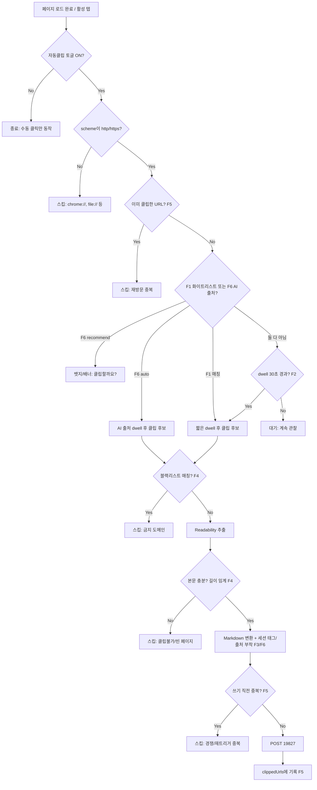

# llm_wiki 크롬 확장 — 자동 클리핑 기능 구현 계획

> 상태: Draft v0.2 · 대상: `nashsu/llm_wiki`의 `extension/` (Manifest V3)
> 목적: 수동 클릭 클리핑을 **조건 기반 자동 클리핑**으로 확장

---

## 1. 목표 & 핵심 전략

현재 확장의 클립 흐름은 이렇다:

```
사용자 클릭 → Readability.js(본문 추출) → Turndown.js(→ Markdown)
           → POST http://127.0.0.1:19827 (앱으로 전송)
           → 앱이 2단계 인제스트 자동 실행 (clip watcher 3초 폴링)
```

**우리가 바꾸는 건 맨 앞의 "사용자 클릭" 트리거 하나뿐이다.** 추출·변환·전송·인제스트·중복제거(앱의 SHA256 캐시)는 전부 그대로 재사용한다. 앱(Rust/Tauri) 본체는 원칙적으로 손대지 않는다 — 단 하나, **F3(태그)** 만 예외적으로 앱을 건드릴 수 있다(3항, 6.3 참고).

구현할 6개 기능:

| # | 기능 | 한 줄 요약 |
|---|---|---|
| F1 | 화이트리스트 자동 클리핑 | 등록한 사이트 진입 시 자동 클립 |
| F2 | 30초 dwell 자동 클리핑 | 토글 ON 후, 실제로 30초 이상 본 페이지 자동 클립 |
| F3 | 세션 태그 | 세션 시작 시 지정한 태그/제목을 모든 클립에 부착 |
| F4 | 블랙리스트 + 클립불가 스킵 | 금지 도메인 및 본문 추출 실패 페이지 건너뜀 |
| F5 | 재방문 중복 스킵 | 이미 클립한 URL 재방문 시 건너뜀 |
| F6 | AI 출처 기반 자동클립/추천 | claude.ai·ChatGPT 등 AI 채팅에서 넘어온 페이지를 화이트리스트 아니어도 클립 후보로 |

---

## 2. 먼저 확인할 것 (이 계획의 전제)

이 문서는 문서화된 인터페이스 기준이다. **코딩 전에 실제 `extension/` 소스에서 아래를 확인**하고, 다르면 이 계획을 갱신한다.

- [ ] 수동 클립이 **content script**에서 추출하는지, **service worker가 `chrome.scripting.executeScript`로 주입**하는지 (Readability/Turndown 실행 위치)
- [ ] 앱으로 보내는 **POST 페이로드 스키마** (필드: url, title, markdown, projectId 등 실제 키 이름)
- [ ] 클립 수신 포트가 `19827`이 맞는지, 엔드포인트 경로
- [ ] `manifest.json`의 현재 `permissions` / `host_permissions`
- [ ] 프로젝트(멀티 위키) 선택 값이 어디에 저장되는지 (`chrome.storage`?)
- [ ] 앱이 클립을 `raw/sources/`에 어떤 파일명 규칙으로 떨어뜨리는지 (F5 중복·F3 태그 판단에 영향)

---

## 3. 전체 아키텍처 (역할 분담)

MV3 3-컴포넌트로 나눈다. 핵심은 **dwell 타이머를 content script가 소유**하는 것 — service worker는 30초 유휴 시 죽기 때문(7항).

```
┌─────────────────────────────────────────────────────────────┐
│ Popup (UI)                                                   │
│  · 자동 클립 ON/OFF 토글                                     │
│  · 세션 태그 입력창                                          │
│  · 화이트리스트 / 블랙리스트 편집                           │
│  → 모두 chrome.storage.local 에 기록                        │
└─────────────────────────────────────────────────────────────┘
        │ (storage)                          ▲ (storage)
        ▼                                    │
┌─────────────────────────────────────────────────────────────┐
│ Service Worker (background) — "판정 + 전송"                  │
│  · webNavigation/tabs 이벤트 수신                           │
│  · 게이트 판정: 토글→scheme→중복→화이트리스트/AI출처       │
│  · 블랙리스트/본문길이/쓰기직전 중복은 후보 승격 후 재검증 │
│  · 화이트리스트 매칭 시 클립 지시                           │
│  · AI 채팅 출처 페이지는 recommend/auto 모드에 따라 처리    │
│  · content script의 "30초 경과" 메시지 수신 시 클립 지시    │
│  · Readability 결과 받아 본문 길이 검증(F4) → 태그 부착(F3) │
│  · POST 19827 → 성공 시 clippedUrls 기록(F5)                │
└─────────────────────────────────────────────────────────────┘
        │ (message)                          ▲ (message)
        ▼                                    │
┌─────────────────────────────────────────────────────────────┐
│ Content Script — "관찰 + 추출"                              │
│  · Page Visibility API로 "실제로 보이는" dwell 시간 측정    │
│  · 30초(가시 시간) 경과 시 SW에 통지 (F2)                   │
│  · SW 지시 시 Readability + Turndown 실행 → 결과 반환       │
│  · 같은 탭 이동의 document.referrer 폴백 제공 (F6)          │
└─────────────────────────────────────────────────────────────┘
```

---

## 4. 통합 판정 파이프라인 (6개 기능이 하나의 흐름으로)

기능들은 독립적이지 않다. 한 페이지에 대해 아래 순서로 게이트를 통과해야 클립된다.

F5 중복 게이트 통과 후, **F1 화이트리스트 판정과 병렬로** "출처가 AI 채팅인가?" 분기를 둔다.
AI 출처면 클립 후보로 승격하되, 이후 게이트(F4 블랙리스트·본문길이, F5 중복, F3 태그)는 동일하게 적용된다.
→ 즉 AI가 링크한 은행 페이지 같은 건 F4에서 여전히 걸러진다.



의사코드(service worker 게이트 함수):

```js
async function evaluatePage(tabId, url) {
  const cfg = await getConfig();               // storage에서 설정 로드
  if (!cfg.autoClipEnabled) return;            // 마스터 토글
  if (!/^https?:$/.test(new URL(url).protocol)) return;

  const norm = normalizeUrl(url);              // F5: 정규화
  if (cfg.clippedUrls[norm]) return;           // F5: 중복

  const whitelisted = matches(norm, cfg.whitelist); // F1
  let aiSource = await getAiSourceProvenance(tabId, cfg.aiOriginDomains); // F6

  if (!whitelisted && aiSource && cfg.aiSourceMode === "recommend") {
    await showClipRecommendation(tabId, { reason: "ai-source", provenance: aiSource });
    return;
  }

  if (aiSource && cfg.aiSourceMode === "off") {
    // F6만 끄고 F1/F2는 계속 허용한다.
    aiSource = null;
  }

  // 화이트리스트면 짧은 확인 dwell, AI auto면 AI 출처 dwell,
  // 아니면 30초 dwell(F2)
  const requiredDwellMs = whitelisted
    ? cfg.whitelistDwellMs
    : aiSource
      ? cfg.aiSourceDwellMs
      : cfg.dwellMs;

  scheduleDwellClip(tabId, norm, requiredDwellMs, {
    trigger: whitelisted ? "whitelist" : aiSource ? "ai-source" : "dwell",
    provenance: aiSource,
  });
}

// content script가 dwell 충족을 통지하면 실행
async function doClip(tabId, norm, cfg, meta = {}) {
  if (matches(norm, cfg.blacklist)) return;       // F4: AI 출처여도 우회 금지
  if (cfg.clippedUrls[norm]) return;              // F5: 쓰기 직전 재검증

  const extracted = await runReadability(tabId);  // 기존 추출 재사용
  if (!extracted || extracted.textLength < cfg.minChars) return; // F4 클립불가

  const md = withSessionTagAndProvenance(
    extracted.markdown,
    cfg.sessionTag,
    meta.provenance,
  ); // F3/F6

  const ok = await postClip({
    url: norm,
    title: extracted.title,
    markdown: md,
    projectId: cfg.projectId,
  });

  if (ok) {
    cfg.clippedUrls[norm] = { ts: Date.now() };   // F5 기록
    await saveClippedUrls(cfg.clippedUrls);
  }
}
```

---

## 5. 데이터 모델 (`chrome.storage.local`)

```jsonc
{
  "autoClipEnabled": false,        // F2 마스터 토글
  "sessionTag": "",                // F3 현재 세션 태그 (빈 문자열이면 태그 없음)
  "sessionStartedAt": null,        // F3 세션 시작 시각 (선택)

  "dwellMs": 30000,                // F2 일반 dwell 임계 (30초)
  "whitelistDwellMs": 3000,        // F1 화이트리스트용 짧은 확인 dwell
  "aiSourceDwellMs": 10000,        // F6 AI 출처 auto 모드 dwell
  "minChars": 400,                 // F4 클립불가 판정 본문 최소 길이

  "whitelist": ["example.com", "*.arxiv.org", "docs.*/guide/*"], // F1
  "blacklist": ["*.bank.com", "mail.google.com", "*.internal"],  // F4
  "aiOriginDomains": ["chatgpt.com", "chat.openai.com", "claude.ai", "gemini.google.com", "perplexity.ai"], // F6
  "aiSourceMode": "recommend",     // F6: "recommend" | "auto" | "off"

  "clippedUrls": {                 // F5 (URL 정규화 키)
    "https://example.com/article/123": { "ts": 1730000000000 }
  },
  "reclipTtlDays": 0               // F5 재클립 정책: 0이면 영구 스킵
}
```

패턴 매칭은 **Chrome match-pattern 스타일**(`*.domain.com/path/*`) 또는 단순 도메인 문자열을 지원. `clippedUrls`가 커지면(수천 개↑) 성능을 위해 나중에 `IndexedDB` 이관 고려.

F6의 provenance 플래그는 영속 설정이 아니라 tabId 키의 SW 메모리 또는 `chrome.storage.session`에 임시 보관한다. 클립 단계에서만 참조하고, 탭 종료·클립 완료·TTL 만료 시 제거한다.

---

## 6. 기능별 상세

### 6.1 F1 — 화이트리스트 자동 클리핑
- **동작**: 등록된 패턴에 URL이 매칭되면, 짧은 확인 dwell(`whitelistDwellMs`, 기본 3초) 후 클립. 즉시 클립하지 않는 이유 = 잘못 들어갔다 바로 나가는 페이지 방지.
- **트리거**: `chrome.webNavigation.onCompleted`(main frame만) + `chrome.tabs.onActivated`.
- **매칭 유틸**: 도메인/서브도메인/경로 프리픽스/글롭. `URL` 파싱 후 host+pathname 대조.
- **엣지**: SPA는 `onCompleted`가 안 뜰 수 있음 → 6.6 참고.

### 6.2 F2 — 30초 dwell 자동 클리핑
- **동작**: 마스터 토글 ON 상태에서, 화이트리스트가 아니어도 **가시(visible) 상태로 30초 이상** 머문 페이지를 자동 클립.
- **가시 시간 측정(중요)**: 벽시계 30초가 아니라 **탭이 실제로 보이는 시간** 누적.
  - content script에서 `document.visibilitychange` 구독.
  - 보일 때 타이머 시작, 숨겨지면(다른 탭/최소화) 일시정지, 누적이 30초 도달 시 SW에 통지.
  - 백그라운드 탭이 카운트되는 문제를 이걸로 차단.
- **왜 content script가 타이머를 갖나**: MV3 service worker는 유휴 시 죽어서 `setTimeout`이 신뢰 불가(7항). content script는 페이지가 열려 있는 동안 정상 수명.

### 6.3 F3 — 세션 태그 / 제목
- **동작**: 팝업에서 세션 시작 시 태그(예: `유전체-프로젝트`)를 입력 → 세션 동안 모든 클립에 부착.
- **문제**: 문서화된 클립 입력에는 `type/title/sources[]` 외 **태그 필드가 없다.** 태그를 위키에 실제로 남기는 3가지 방법:
  - **(A) MVP — 마크다운에 심기**: POST 전 마크다운 상단에 YAML frontmatter/마커를 붙임. 예:
    ```
    ---
    tags: [유전체-프로젝트]
    clipped_at: 2026-07-01
    ---
    ```
    앱 변경 0. 인제스트 LLM이 이 맥락을 읽음. **먼저 이걸로 간다.**
  - **(B) 정식 — 앱 확장**: 클립 페이로드에 `tags[]` 추가 + 수신 핸들러(Rust/TS)가 소스 frontmatter의 `sources[]`처럼 `tags[]`를 기록. copyleft·유지보수 비용 있음. 구조화 태그가 꼭 필요할 때만.
  - **(C) schema.md/purpose.md 규약**: 위키 쪽에 "tags 필드를 존중하라"는 규칙을 심어 (A)의 태그가 구조로 승격되게 유도.
- **결정**: (A)로 시작, 태그로 그래프/검색이 실제로 필요해지면 (C)→(B) 순서로 승격.

### 6.4 F4 — 블랙리스트 + 클립불가 스킵
- **블랙리스트(명시적)**: 은행·이메일·사내 문서 등 민감/무의미 도메인. 화이트리스트와 같은 매칭 인프라, **클립 후보 승격 후에도 반드시 통과해야 하는 게이트**에서 short-circuit.
- **클립불가(자동 감지)**: Readability 결과의 본문 길이가 `minChars`(기본 400) 미만이면 스킵. 대시보드·검색결과·빈 SPA가 위키를 오염시키는 것 방지.
- **추가 스킵**: `http/https` 아닌 scheme, 로그인/auth 패턴 URL(선택).

### 6.5 F5 — 재방문 중복 스킵
- **동작**: 클립 성공한 URL을 `clippedUrls`에 기록, 재방문 시 스킵.
- **URL 정규화**: fragment(`#...`) 제거, 트래킹 파라미터(`utm_*`, `fbclid`, `gclid`) 제거, 트레일링 슬래시·host 소문자화. **일반 쿼리(`?id=`)는 보존**(페이지 식별에 쓰이므로).
- **2단 중복 방어**: 확장 쪽 URL 단위 스킵(네트워크 왕복·재트리거 절약) + 앱 쪽 **SHA256 내용 캐시**(내용 동일 시 인제스트 스킵). 둘이 겹쳐 안전.
- **재클립 정책**: `reclipTtlDays=0`이면 영구 스킵(기본). >0이면 그 기간 지난 재방문은 다시 클립(내용 갱신 대응). 내용 변화 감지까지 원하면 앱의 SHA256에 위임.

### 6.6 공통 엣지 — SPA 내비게이션
Gmail/Notion/트위터 등은 전체 로드 없이 내용만 바뀌어 `onCompleted`가 안 뜬다.
- `chrome.webNavigation.onHistoryStateUpdated` 추가 구독 + content script에서 `history.pushState`/`popstate` 감지 → URL 변경 시 dwell 타이머 리셋 후 재판정.
- 단 이런 사이트 상당수는 애초에 블랙리스트 대상이거나 Readability가 약함 → F4가 2차 방어.

### 6.7 F6 — AI 출처 기반 자동클립 / 추천
- **핵심 발상 뒤집기**: F1은 *목적지* 도메인을 화이트리스트에 넣지만, F6은 *출발지*를 넣는다. "AI 채팅에서 넘어왔으면, 목적지가 뭐든 클립 후보." AI가 근거로 제시한 페이지는 대체로 볼 가치가 있다는 신호를 활용.
- **출처 감지**:
  - 새 탭으로 열린 경우: `chrome.webNavigation.onCreatedNavigationTarget`가 주는 `sourceTabId`로 출발 탭의 URL을 확인 → `aiOriginDomains`에 매칭되면 provenance=AI. **가장 신뢰도 높은 경로.**
  - 같은 탭 이동: 탭별 직전 committed URL(`onCommitted`로 추적) 또는 content script의 `document.referrer` 폴백.
  - provenance 플래그는 tabId 키로 SW 메모리/`session` 스토리지에 임시 보관 → 클립 단계에서 참조.
- **모드 (`aiSourceMode`)**:
  - `recommend` (기본): 자동클립하지 않고 뱃지/배너로 "클립할까요?"만 표시(`chrome.action.setBadgeText`). AI 링크는 품질 편차가 커서 침묵 자동클립보다 안전.
  - `auto`: 가시 dwell `aiSourceDwellMs`(기본 10초, 일반 30초보다 짧게 — AI 출처가 강한 신호라서) 충족 시 자동클립. 잠깐 열었다 닫는 페이지는 여전히 배제.
  - `off`: 비활성.
- **엣지 & 주의**:
  - AI 사이트는 아웃바운드 링크를 리다이렉터로 감싸거나 referrer를 지우는 경우가 많음 → `document.referrer`보다 `sourceTabId` 우선.
  - AI 채팅 자체가 SPA지만, *출발 탭의 URL*(채팅 페이지)은 안정적이라 출처 판정엔 문제없음.
  - `aiOriginDomains`는 화이트리스트처럼 사용자 편집 가능하게.
  - (선택/후순위) 어느 답변·맥락에서 넘어왔는지 채팅 DOM을 스크랩해 함께 기록 — MVP 제외.

---

## 7. MV3 제약 & 대응

| 제약 | 영향 | 대응 |
|---|---|---|
| service worker 30초 유휴 시 종료 | SW의 `setTimeout` dwell 신뢰 불가 | **dwell 타이머를 content script로** (6.2) |
| SW는 상태 무보존 | 재기동 시 설정 유실 | 모든 상태 `chrome.storage.local`에 |
| content script는 페이지 단위 | 탭 간 조율 필요 | 판정·전송은 SW로 집중, CS는 관찰/추출만 |
| 넓은 host 권한 필요 | dwell-mode는 `<all_urls>` 급 | 로컬 unpacked라 스토어 심사 없음 → 허용 |
| `chrome.alarms` 최소 주기 | 정밀 타이머 부적합 | 30초는 CS 타이머로, alarms는 보조 |
| AI 사이트 referrer 제거/리다이렉터 | F6 출처 손실 가능 | `onCreatedNavigationTarget.sourceTabId`를 1순위로 사용 |

`manifest.json` 추가 예상 권한(확인 후 조정): `"webNavigation"`, `"tabs"`, `"storage"`, `"scripting"`, 그리고 `host_permissions`.

---

## 8. 결정이 필요한 열린 질문

1. **화이트리스트 vs dwell-mode 관계**: 화이트리스트는 마스터 토글과 무관하게 항상 켜둘까, 아니면 토글 ON일 때만? (현재 계획은 **토글이 전부를 게이트**)
2. **태그 승격 시점**: (A) 마크다운 심기로 충분한가, 언제 (B) 앱 확장으로 갈까?
3. **재클립 TTL 기본값**: 영구 스킵(0) vs N일 후 재클립?
4. **쿼리 파라미터 정규화 정책**: 어디까지 트래킹 파라미터로 볼지 화이트리스트/블랙리스트 방식으로 관리?
5. **비용 상한**: dwell-mode 전체 켜두면 LLM 인제스트 폭증 → 로컬 Ollama로 인제스트를 돌릴지, 클라우드면 일일 상한을 둘지.
6. **민감정보**: 블랙리스트만으로 충분한가, "제목/URL에 특정 키워드 포함 시 스킵" 규칙도 넣을까?

---

## 9. 구현 단계 (마일스톤)

각 단계는 독립적으로 테스트 가능하게 쪼갬.

- **M0 — 정찰**: 2항 체크리스트로 실제 소스 확인, POST 스키마·추출 위치 확정. 이 문서 갱신.
- **M1 — 설정 & 팝업**: storage 스키마 구현 + 팝업에 토글/태그입력/화이트·블랙리스트 편집 UI. (아직 자동 클립 없음, 수동만)
- **M2 — F1 화이트리스트**: `onCompleted` 수신 → 매칭 → 짧은 dwell → 기존 추출/전송 재사용해 자동 클립.
- **M3 — F4 블랙리스트 + 클립불가**: 후보 승격 후 필수 스킵 + 본문 길이 검증.
- **M4 — F5 중복 스킵**: URL 정규화 + `clippedUrls` 기록/조회.
- **M5 — F2 dwell 30초**: content script 가시 타이머 + SW 통지 경로. (여기서 SPA·visibility 엣지 처리)
- **M6 — F3 세션 태그**: (A) 마크다운 심기. 필요 시 (C)/(B).
- **M7 — 안정화**: SPA, 재기동, 대량 clippedUrls 성능, 로그/디버그 패널.
- **M8 — F6 AI 출처 트리거**: M5의 dwell 인프라 재사용. recommend 모드부터 → auto 승격. (M7 안정화 전에 넣어도 됨)

---

## 10. 테스트 체크리스트

- [ ] 화이트리스트 사이트 진입 → 3초 후 자동 클립, 앱에 위키 생성 확인 (F1)
- [ ] 토글 OFF 상태에선 어떤 자동 클립도 안 됨
- [ ] 임의 기사에서 30초 체류 → 클립 / 10초만 있다 이탈 → 클립 안 됨 (F2)
- [ ] 다른 탭으로 숨긴 채 30초 → 클립 안 됨(가시 시간 정지 검증) (F2)
- [ ] 세션 태그 입력 후 클립 → 위키 소스 frontmatter/본문에 태그 반영 (F3)
- [ ] 블랙리스트 도메인 → 스킵 (F4)
- [ ] 빈/짧은 페이지 → 스킵, 위키 오염 없음 (F4)
- [ ] 같은 기사 재방문 → 스킵 (F5)
- [ ] 트래킹 파라미터만 다른 같은 URL → 같은 것으로 취급해 스킵 (F5)
- [ ] SPA에서 내부 이동 시 URL 변경 감지 & 타이머 리셋 (6.6)
- [ ] 브라우저 재시작 후 설정/기록 유지 (7항)
- [ ] AI 채팅에서 링크 클릭(새 탭) → recommend면 뱃지, auto면 dwell 후 클립 (F6)
- [ ] referrer 없는 리다이렉트 링크에서도 sourceTabId로 출처 감지 (F6)
- [ ] AI 출처라도 블랙리스트/중복 게이트는 그대로 적용 (F6 × F4/F5)
